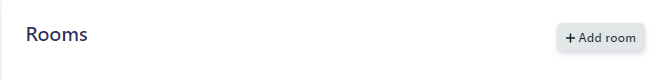
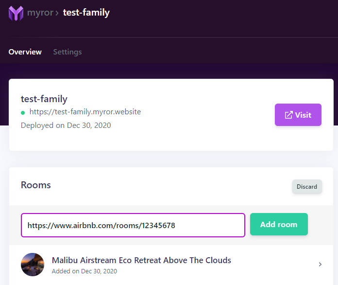
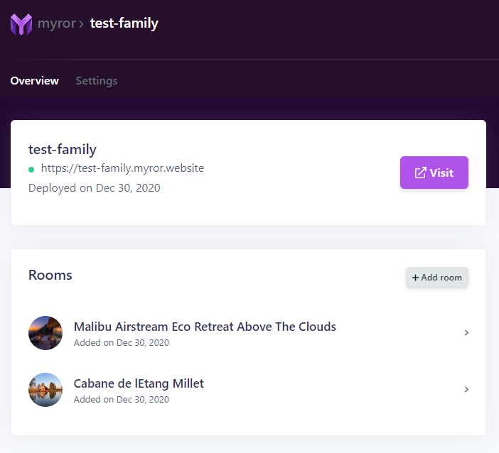

Once you have created a site, you can append several rooms to it. From the **Sites** page, click on a site to open its details.
Then click on the **"+ Add room"** button in the Rooms section. 

It will open an input field where you will be able to paste the link of another Airbnb listing.

Make also sure that the link to your Airbnb listing has the following format: `https://www.airbnb.com/rooms/...`

You can finally click on the green **"Add room""** button, your new room will be displayed in the Rooms section!

> New added rooms will instantly appear on your booking site (you may need to refresh your booking site and clear your cache)

## Next
____

Do not forget to [connect a calendar](/articles/connect-calendar) for this room to start accepting bookings.