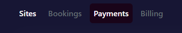
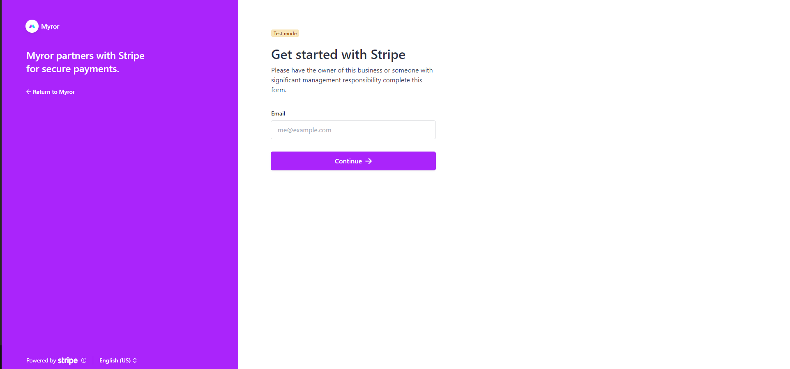
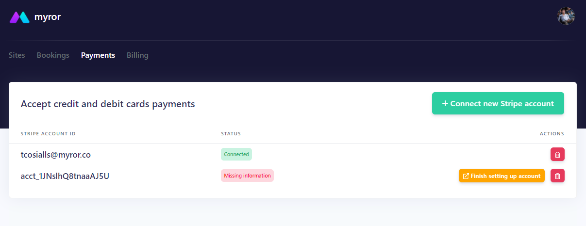
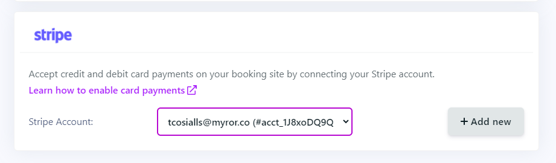

> You need to subscribe to the PRO package to unlock this functionality.

## Connect your Stripe account

Go through the following steps to take advantage of one of the most exciting feature of Myror: **accepting secure direct payments from your Myror-powered booking site, with zero fees from our end** (Stripe takes a small percentage - around 3% - on each transaction).

1. Connect to your Myror account then toogle the **Payments** tab.

2. Click on the **Connect new Stripe account** button
3. You will be redirected to an onboarding page. Go through all the steps and provide the required documents.

4. If you leave the onboarding page before the end or if you need to provide additional documents, you will get a **Missing information** status. Click on the **Finish setting up account** button to complete your onboarding.

5. If your onboarding was successful, you will see the **Connected** status next to your Stripe account.
6. Go to your Site Setting, you will be able to pick the connected Stripe account from the select box. 

