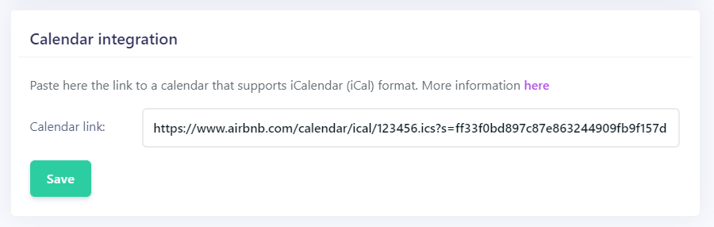

> You need to connect a Calendar with iCal format to a room to start accepting booking requests.

## Import a Calendar from your Airbnb

### Get the export URL

Calendar exporting lets you view your synced Airbnb calendar for a specific room on your booking site.

To retrieve your Airbnb calendar export URL, log in to your Airbnb account on a desktop computer or mobile device. This feature is not available using the Airbnb app.

1. Go to your dashboard > Listings and select a listing
2. Click **Availability**
3. Click **Export Calendar** found under **Sync calendars**
4. In the **Export Calendar** window, copy the URL address

### Paste URL in Room settings

From your Myror Dashboard, go to *Sites > {Room name} > Room Details > Calendar Integration*, paste the URL address and save. 

Now, when you open the calendar of the room on the booking site, availabilities will appear and guests will be able to submit a booking request form.