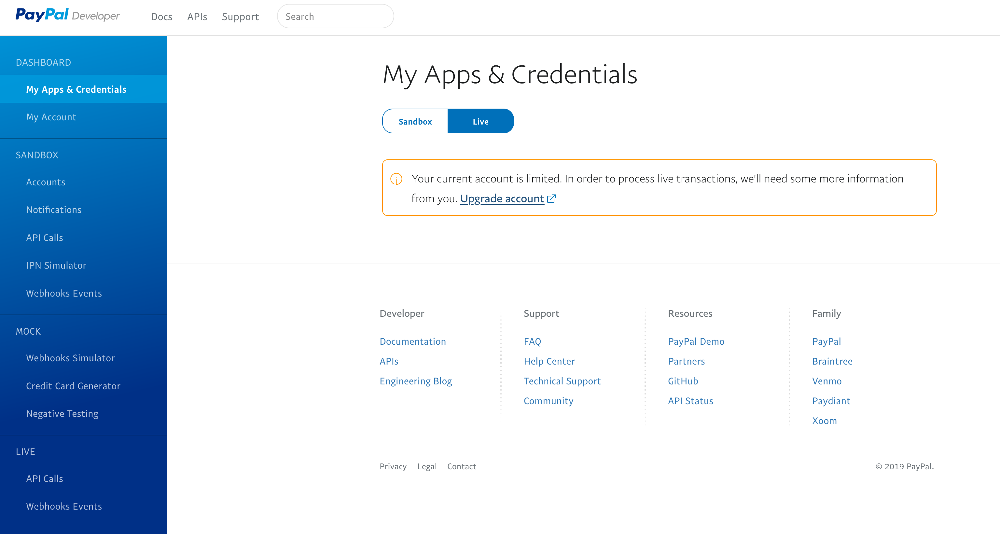
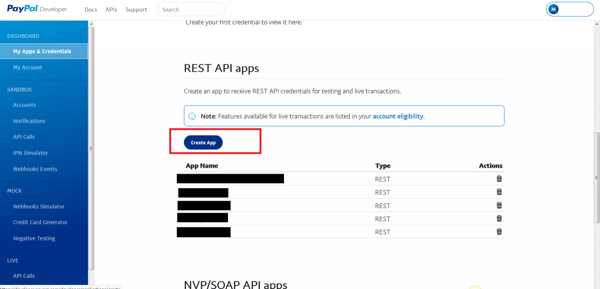
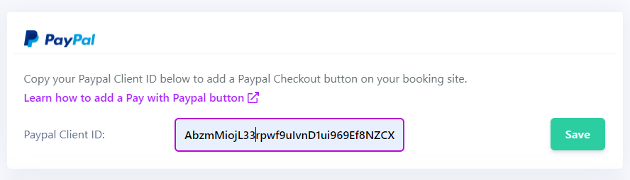

> You need to subscribe to the PRO package and own a Paypal Business account to unlock this functionality.

## Get your Paypal Client ID

First, you need to get your **Paypal Client ID** from your Paypal dashboard.

1. Log in to the [Developer Dashboard](https://www.paypal.com/signin?returnUri=https%3A%2F%2Fdeveloper.paypal.com%2Fdeveloper%2Fapplications) with your PayPal business account.
2. Under the **Dashboard** menu, select **My Apps & Credentials** and toogle the **Live** button (do not do the following steps in Sandbox)
3. If you do not have a Business Account, you will see the screen below. Click the **Upgrade Accoun** link and follow the prompts

4. Click on the **Create App** button

5. Enter an **App Name** (like the name of your listing) and then click the **Create App** button

6. Copy your **Client ID**

## Copy your Paypal Client ID in your Myror site settings

1. Login into your Myror account and go to Sites > select a site
2. Click on **Site Settings**
3. Copy your Client ID and click **Save**

If the Paypal Client ID is correct, you will see the following Paypal button on the booking page of your site: 

