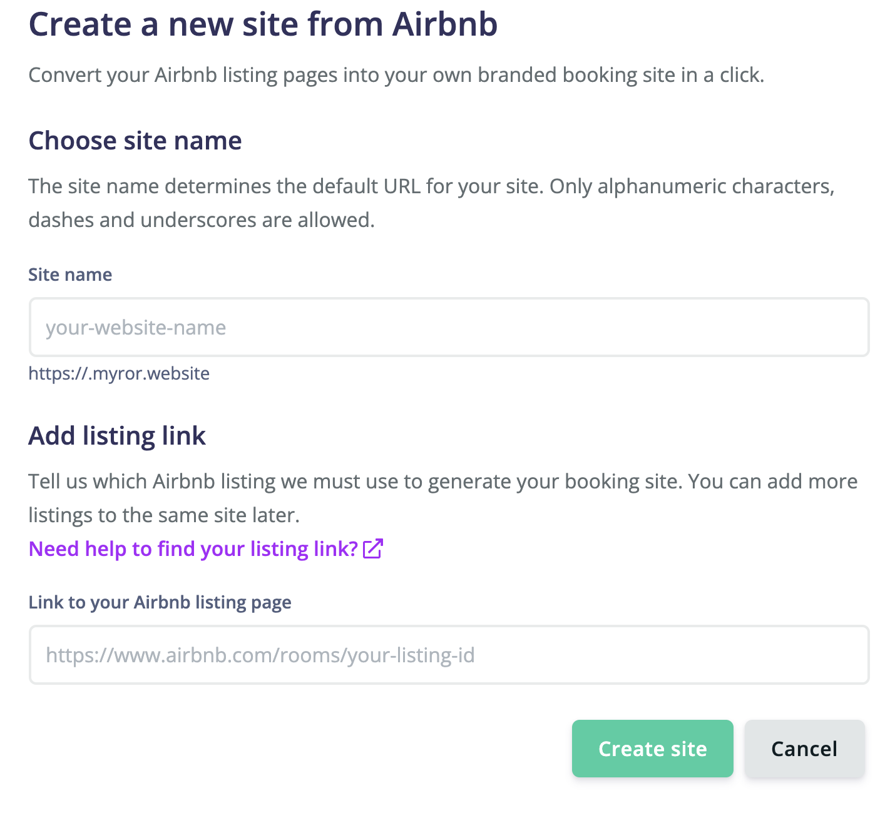
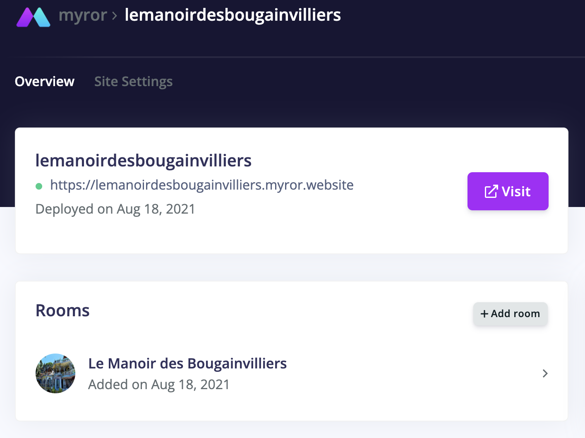

> You currently need to own an existing Airbnb listing to generate your booking site.

### Add a new site

When you are on the [Sites](https://app.myror.co/sites) page, click on **"New site from Airbnb"** button or follow directly this [link](https://app.myror.co/start).

### Choose a name and paste an Airbnb Listing URL

To generate a booking site with one first room, you simply need to **choose a site name** and **paste a link to an Airbnb listing**. The booking site content (texts and images) will be generated using the data provided by the Airbnb listing. You will be able to add/remove rooms and modify website content later so you can pick any Airbnb listing that you want to showcase on your site.

Your site name must be in small letters and can only contain alphanumeric caracters as well as dashes and underscores.
Make also sure that the link to your Airbnb listing has the following format: `https://www.airbnb.com/rooms/...`

> <small style="color:orange"><b>Warning:</b> Your Airbnb listing must be publicly listed</small>

### Submit

You can now click on the **"Create site"** button. You will be directly redirected to the site details:

Your generated website URL ended by `myror.website` will be visible below your site name approximately 2 minutes after submitting the new site creation form. 

## Next step
____

Congrats! You now have your own branded booking site with a single room. Click on the **"Visit"** button to see your booking site live and start sharing your site link with friends and guests.

You are not done yet! We suggest you read the following tutorials to make your site ready for booking requests, customize its appearance and add more rooms: 
- [Edit site details](/articles/edit-site-details)
- [Add a custom domain](/articles/custom-domain)
- [Connect your room calendar](/articles/connect-calendar)
- [Add extra rooms](/articles/add-room)