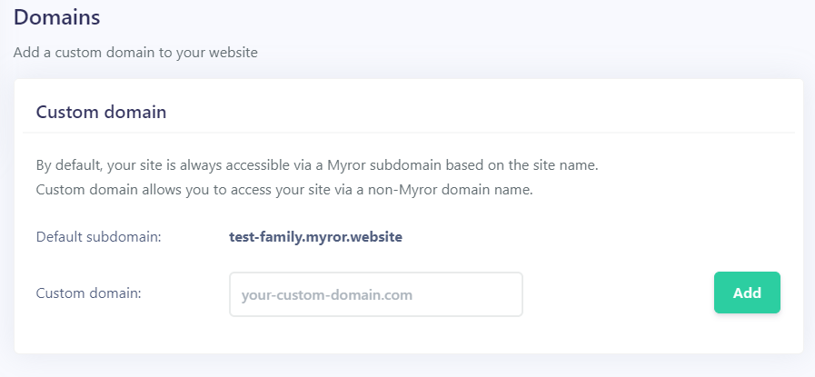
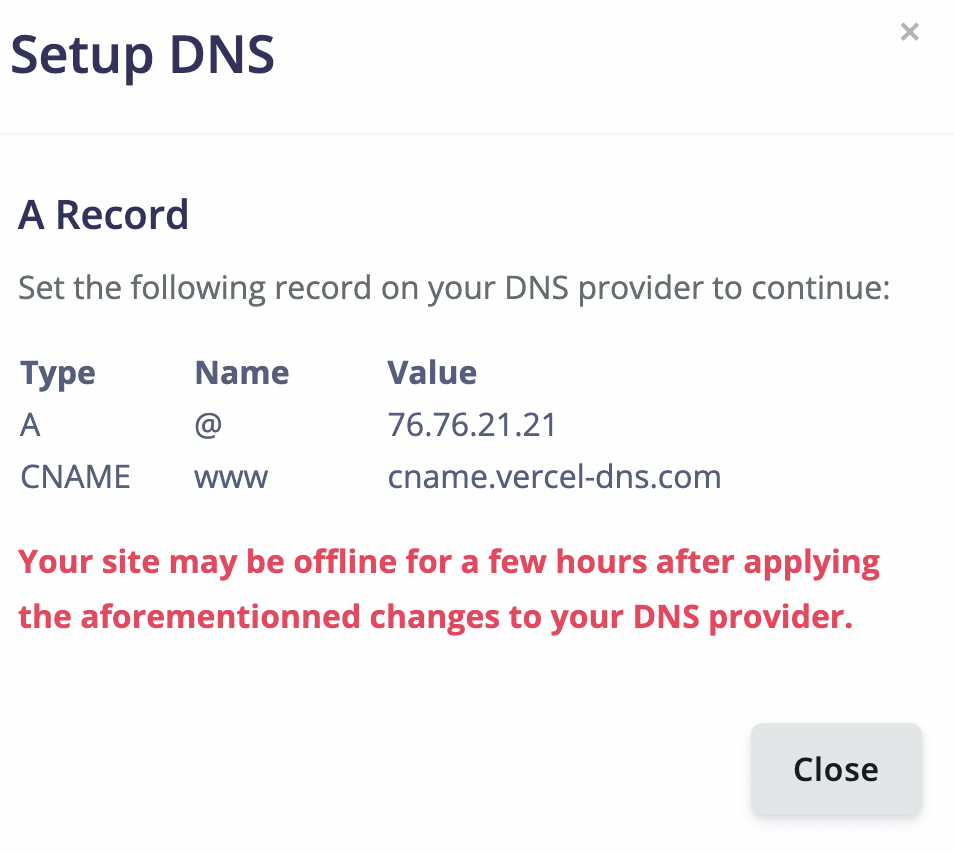

When you create a new booking site, Myror automatically generate your site address by prepending your site name to the *myror.website* domain name.

However, if you own a domain name, you can use it and make it point to your booking site.

> You need to upgrade to our PRO package to be able to connect your custom domain

### Add your custom domain to Myror

Go to *Sites > {Site Name} > Settings > Domains* and add your custom domain name then click on the **"Save"** button.
You domain name should be written without any prefix (no https. or www.) and respect domain name formatting convention to be accepted.

Then click on the **"Setup DNS"** button.

It will open a popup containing information to paste in your domain name adminstration panel. You will have to add 2 records - the **A record** line and the **CNAME record** line - your DNS settings.

### Update the DNS 

Access your domain's DNS settings in your domain registrar's or DNS host's dashboard.

#### Add the A record
1. Add an A record
2. Set the host to @
3. Set the value to 76.76.21.21

#### Add a CNAME record
1. Add a CNAME record
2. Set the host to www
3. Set the value to cname.vercel-dns.com

### How to update the DNS records with your domain registrar
- [Update DNS with Domain.com](https://www.domain.com/help/article/dns-management-how-to-update-dns-records)
- [Update DNS with Bluehost](https://www.bluehost.com/help/article/dns-management-add-edit-or-delete-dns-entries)
- [Update A record with Namecheap](https://www.namecheap.com/support/knowledgebase/article.aspx/319/2237/how-can-i-set-up-an-a-address-record-for-my-domain/) and [CNAME record](https://www.namecheap.com/support/knowledgebase/article.aspx/9646/2237/how-to-create-a-cname-record-for-your-domain/)
- [Update A record with GoDaddy](https://www.godaddy.com/help/add-an-a-record-19238) and [CNAME record](https://www.godaddy.com/help/add-a-cname-record-19236)
- [Update DNS with Dreamhost](https://help.dreamhost.com/hc/en-us/articles/360035516812-Adding-custom-DNS-records)
- [Update DNS with IONOS](https://www.ionos.com/help/domains/configuring-your-ip-address/changing-a-domains-ipv4ipv6-address-aaaaa-record/)
