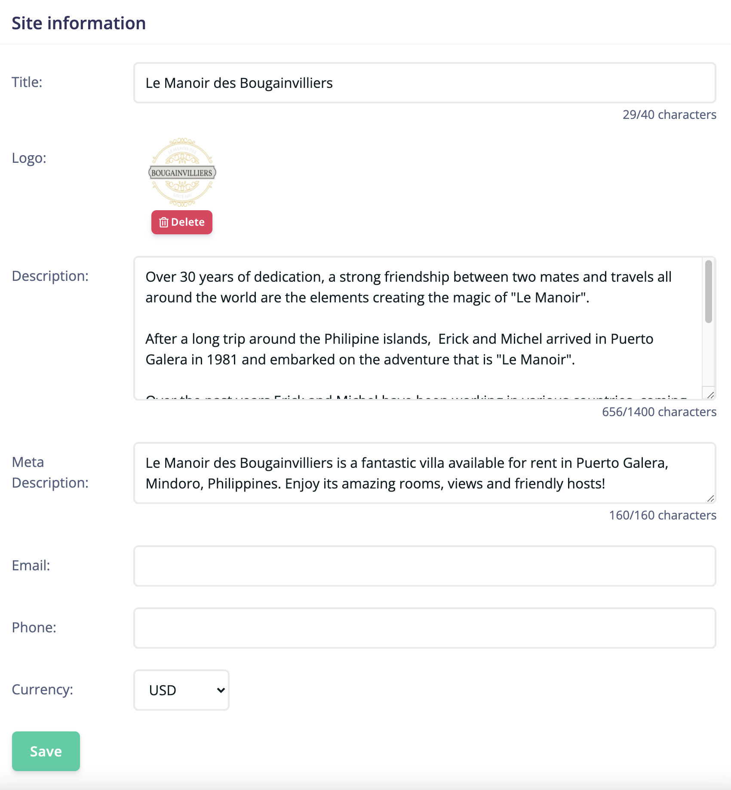

To edit your site information, navigate to *Sites > Site Details > Settings*.
You can edit the elements in the array below. We are precising for each where they are displayed in your booking site. 

| Name          | Display Location      | Required  |
| ------------- |:-------------:| -----:|
| Title      | Landing page | True |
| Logo     | Site header      |   False |
| Description | Landing page      |    True |
| Email | Site header, Contact page      |    True |
| Phone | Site header, Contact page      |    False |
| Currency| Room details, Booking      |    True |
| Facebook Page Link | Site footer      |    False |
| Google Page Link | Site footer      |    False |
| Instagram Page Link | Site footer      |    False |

