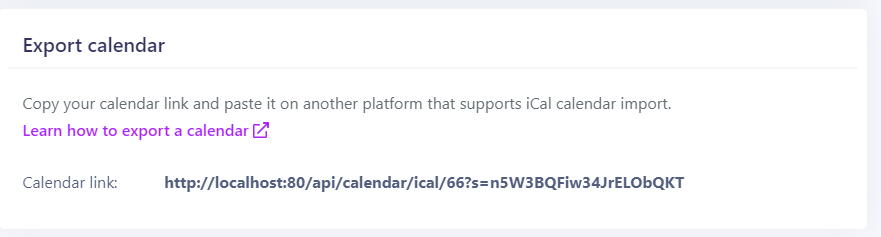

> You need to subscribe to the PRO package to unlock this functionality.

## Export a Calendar from your room settings

### Get the calendar export URL

Using the calendar export link provided by Myror, you can easily keep all your calendars updated whenever you get a new booking from your Myror-powered booking site.

To retrieve a calendar export link (iCal format) for a given room, log in to your Myror account and go to your the room settings.

1. Go to Sites > select a site
2. In Rooms > select a room
3. Go to **Export calendar**
4. Copy the URL address

### Paste the URL on other booking platforms

Here is a list of tutorial to add your Myror calendar URL to your preferred booking platforms:

- [Export to Airbnb](https://www.airbnb.com/help/article/99/how-do-i-sync-my-airbnb-calendar-with-another-calendar#section-heading-2-0)
- [Export to Booking.com](https://partner.booking.com/en-gb/help/rates-availability/extranet-calendar/syncing-your-bookingcom-calendar-third-party-calendars)
- [Export to VRBO](https://www.vrbo.com/en-nz/help/articles/How-do-I-import-my-iCal-or-Google-calendar)
