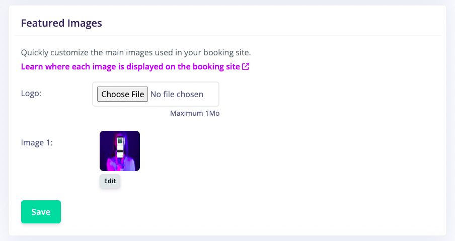
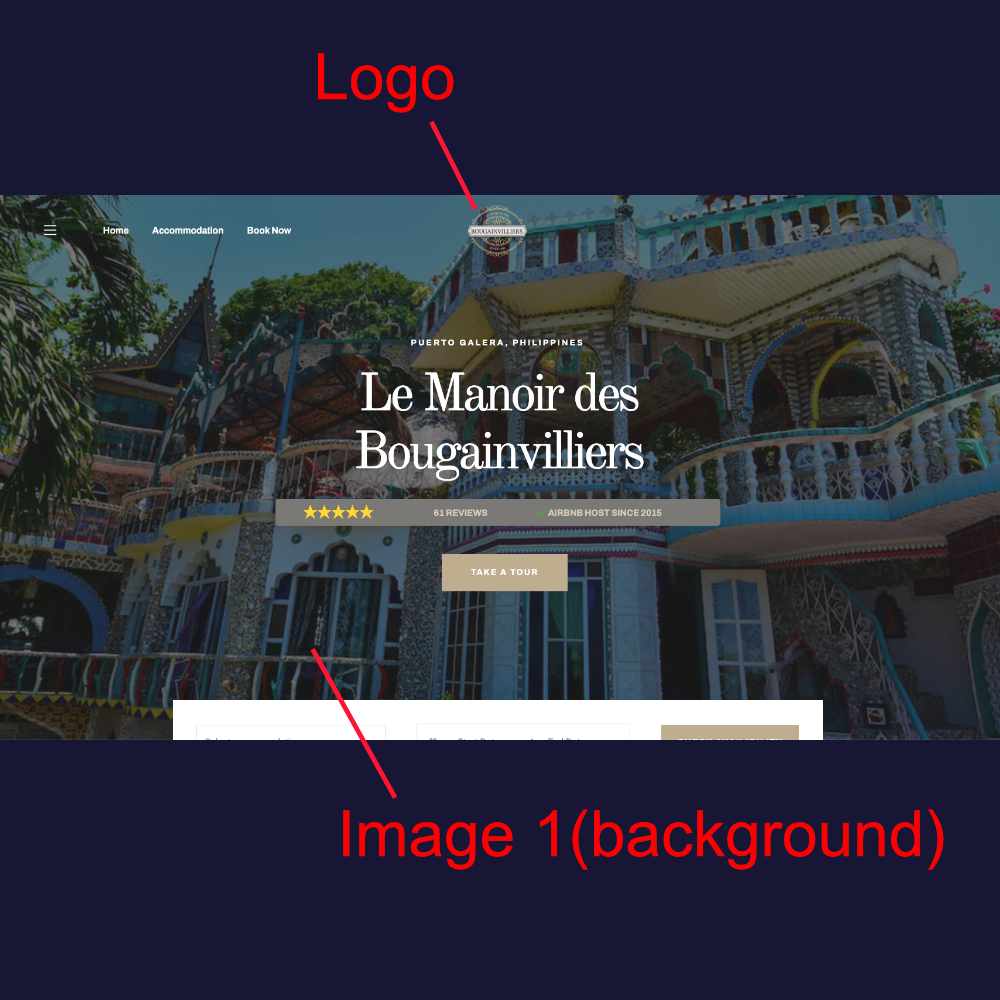

### How to edit your site images

To edit your site images, navigate to *Sites > Site Settings > Featured Images*.

> Note it will take up to 60sec for your changes to reflect on your live website. If you don't see the changes after one minute, kindly empty your cache and refresh the page

### Naming and location of editable images

Here is a list of images that are editable in every templates:

#### Logo

The logo of your website appears on the **top center of your Landing Page** and is also used as your **favicon**.

#### Image 1 (Main Background Picture)

Image 1 is the main picture of your website, used as the **fullscreen background picture** of your Landing Page. 
It is set automatically when you import your first Airbnb listing. 

