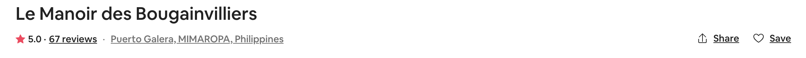
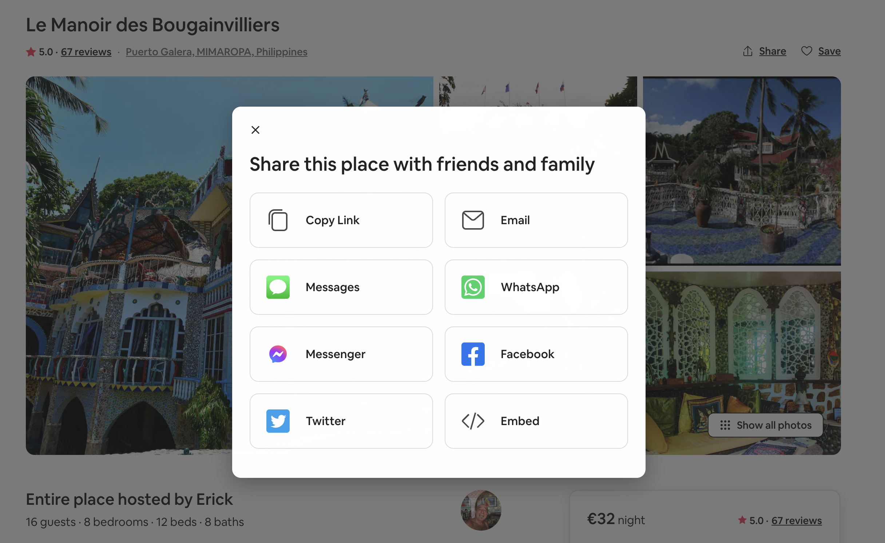

To get the Airbnb link we need to generate your direct booking site, first go to the Airbnb listing page.

### Option 1

You can simply copy the URL of the Airbnb listing page, and paste it in Myror.

### Option 2

Click the **Share** button on the right side of the listing name.

In the pop up that opens, click on **"Copy Link"** and paste it in Myror.

You can also watch our [video tutorial](https://www.youtube.com/watch?v=wMy5wW_huu8) to help you generate your first booking site!

