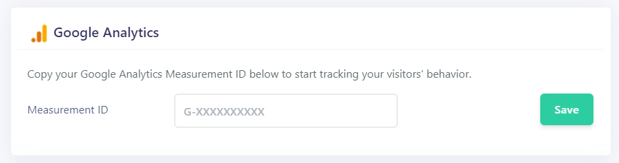

You can easily track your visitor behaviors and statistics by adding the Google Analytics plugin to your booking site.

Go to *Sites > {Site Name} > Settings > Plugins* and find the Google Analytics box. Simply paste your Google Tracker ID (*G-XXXXXXXXX*) and click on the **"Save"** button. You can get your Google Tracker ID from your Google Analytics Settings panel.

